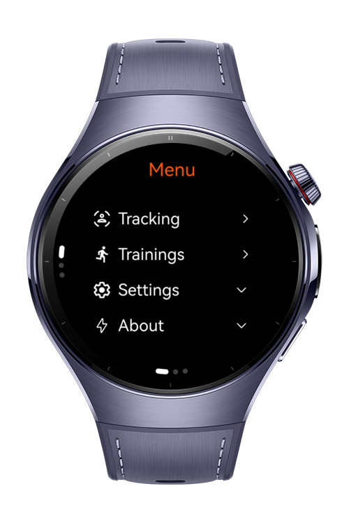
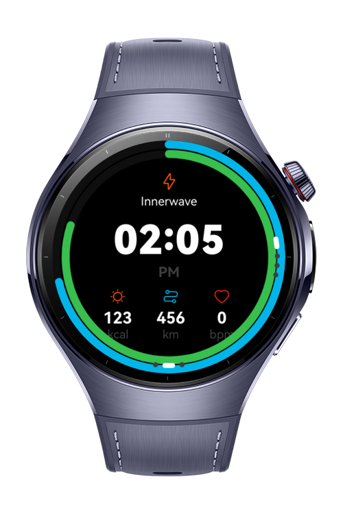
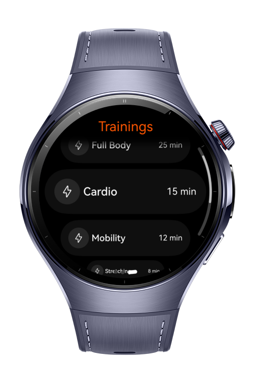
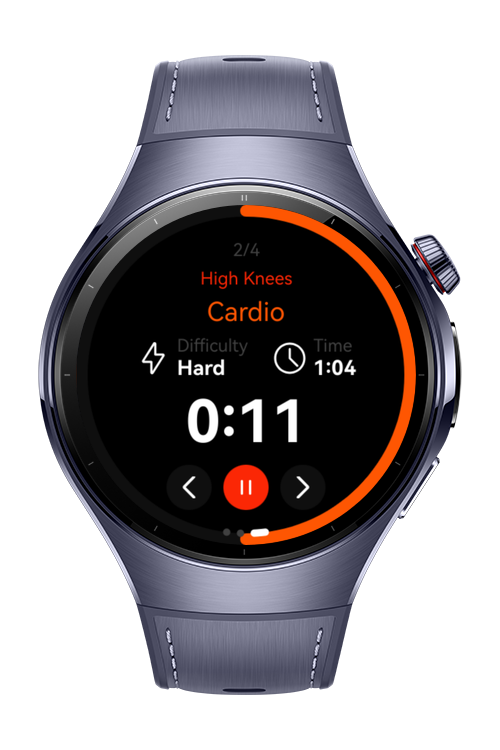

# Innerwave - [Smart-Wearable]

InnerWave is a comprehensive fitness and health tracking application. It empowers users to manage their daily physical activities, monitor workout performance, and track vital signs through a unified interface. By leveraging real-time sensor data and a customizable goal-setting system.

# Preview
<div>
  
  
  
  
</div>

# Use Cases
- Step Tracking & Distance Calculation: Real-time monitoring of daily steps and automatic calculation of distance covered in kilometers/meters.
- Personalized Goal Setting: Define specific daily targets for steps or calories and visualize progress through interactive progress rings.
- Training Management: Train with various workout types, tracking duration and intensity.
- Instant Heart Rate Monitoring: Measure and visualize heart rate (BPM) during resting or high-intensity intervals using biometric sensors.
 
# Technology

## Stack
- Language: ArkTS
- Framework: ArkUI (HarmonyOS NEXT)
- IDE: DevEco Studio 5.0+
- APIs / SDKs:
  - @ohos.sensor: For motion and step detection.
  - @ohos.health.sensor: For real-time Heart Rate (BPM) monitoring.

## Required Permission 
- ohos.permission.HEART_RATE: Required to access biometric heart rate data.

# Directory Structure
```
innerwave-wearable
│  └─ src
│     ├─ main
│     │  ├─ ets
│     │  │  ├─ components
│     │  │  │  ├─ MenuAboutItem.ets
│     │  │  │  ├─ MenuNavigation.ets
│     │  │  │  ├─ MenuOption.ets
│     │  │  │  ├─ TrackerDisplay.ets
│     │  │  │  ├─ TrackerGoal.ets
│     │  │  │  ├─ TrackerHeader.ets
│     │  │  │  ├─ TrackerStatCard.ets
│     │  │  │  ├─ TrackerStatRow.ets
│     │  │  │  ├─ TrainingActionButton.ets
│     │  │  │  ├─ TrainingRowItem.ets
│     │  │  │  ├─ TrainingStatsItem.ets
│     │  │  │  └─ TrainingStatsRow.ets
│     │  │  ├─ entryability
│     │  │  │  └─ EntryAbility.ets
│     │  │  ├─ entrybackupability
│     │  │  │  └─ EntryBackupAbility.ets
│     │  │  ├─ model
│     │  │  │  ├─ ActivityData.ets
│     │  │  │  ├─ SettingModel.ets
│     │  │  │  ├─ StatModel.ets
│     │  │  │  ├─ TrainingData.ets
│     │  │  │  └─ TrainingItem.ets
│     │  │  ├─ navigation
│     │  │  │  └─ TrainingNav.ets
│     │  │  ├─ pages
│     │  │  │  ├─ Index.ets
│     │  │  │  ├─ Menu
│     │  │  │  │  ├─ MenuAboutView.ets
│     │  │  │  │  ├─ MenuSwiper.ets
│     │  │  │  │  └─ MenuView.ets
│     │  │  │  ├─ Settings
│     │  │  │  │  ├─ SettingsSoundView.ets
│     │  │  │  │  └─ SettingsView.ets
│     │  │  │  ├─ Tracker
│     │  │  │  │  ├─ TrackerDailyView.ets
│     │  │  │  │  ├─ TrackerGoalView.ets
│     │  │  │  │  ├─ TrackerHubView.ets
│     │  │  │  │  ├─ TrackerSwiperView.ets
│     │  │  │  │  └─ TrackerWeeklyView.ets
│     │  │  │  └─ Training
│     │  │  │     ├─ TrainingDetailView.ets
│     │  │  │     ├─ TrainingResultView.ets
│     │  │  │     ├─ TrainingTimerView.ets
│     │  │  │     └─ TrainingView.ets
│     │  │  ├─ services
│     │  │  │  └─ TrainingMusicService.ets
│     │  │  ├─ utils
│     │  │  │  ├─ PermissionUtil.ets
│     │  │  │  └─ TrainingTimerUtils.ets
│     │  │  └─ viewmodel
│     │  │     ├─ ClockViewModel.ets
│     │  │     ├─ HearthRateViewModel.ets
│     │  │     ├─ TrackerViewModel.ets
│     │  │     └─ TrainingViewModel.ets

```

# Constraints and Restrictions
## Supported Devices
Huawei Watch 5

# License
**Innerwave** is distributed under the terms of the MIT License  
See the [LICENSE](./LICENSE) for more information.